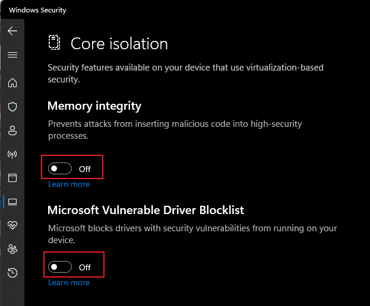

<br />
<div align="center">
  
  <h3 align="center">NWinfo</h3>
  
  
  
</div>
<br />

NWinfo is a Win32 program that allows you to obtain system and hardware information.

## Features
* Obtain detailed information about SMBIOS, CPUID, S.M.A.R.T., PCI, EDID, and more.
* Support exporting in JSON, YAML, and LUA table formats.
* Compatible with Windows XP.

## Note
For Windows 11, the "Memory Integrity" option should be disabled.



## Usage
```
.\nwinfo.exe OPTIONS
OPTIONS:
  --format=XXX     Specify output format. [YAML|JSON|LUA]
  --output=FILE    Write to FILE instead of printing to screen.
  --cp=XXXX        Set the code page of output text. [ANSI|UTF8]
  --human          Display numbers in human readable format.
  --debug          Print debug info to stdout.
  --hide-sensitive Hide sensitive data (MAC & S/N).
  --sys            Print system info.
  --cpu            Print processor details.
  --net[=active]   Print network information for each adapter interface.
  --acpi[=XXXX]    Print ACPI tables.
  --smbios[=XX]    Print SMBIOS tables.
  --disk           Print disk S.M.A.R.T and partitions.
  --no-smart       Don't print disk S.M.A.R.T. info.
  --display        Print display monitors information (EDID).
  --pci[=XX]       List PCI devices.
  --usb            List USB devices.
  --spd            Print SPD information of memory modules (Experimental).
  --battery        Print battery information.
  --uefi           Print UEFI boot information.
  --shares         List network mapped drives.
```

## Credits

* [libcpuid](https://libcpuid.sourceforge.net)
* [SysInv](https://github.com/cavaliercoder/sysinv)
* [DumpSMBIOS](https://github.com/KunYi/DumpSMBIOS)
* [CrystalDiskInfo](https://github.com/hiyohiyo/CrystalDiskInfo)
* [CrystalDiskInfoEmbedded](https://github.com/iTXTech/CrystalDiskInfoEmbedded)
* [Nuklear](https://github.com/Immediate-Mode-UI/Nuklear)
* [HardInfo](https://github.com/lpereira/hardinfo)
* [Memtest86+](https://github.com/memtest86plus/memtest86plus)
* [hwdata](https://github.com/vcrhonek/hwdata)
* [Linux USB](http://www.linux-usb.org)
* [The PCI ID Repository](https://pci-ids.ucw.cz)
* [Ventoy](https://github.com/ventoy/Ventoy)

