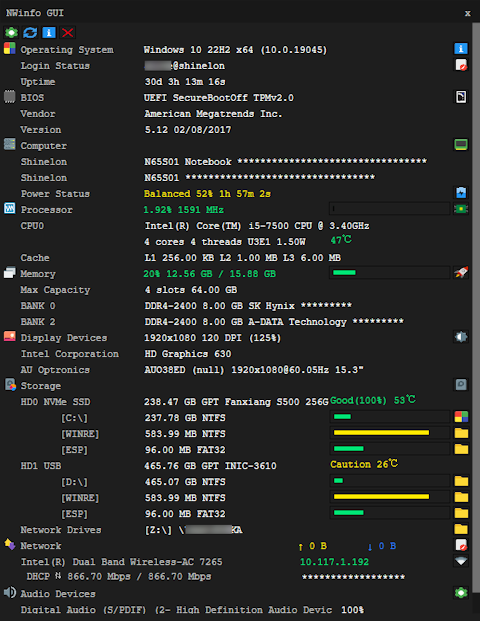

 

  
  <h2 align="center">NWinfo</h2>
  

    
    
  

 

**NWinfo** is a Win32 program that allows you to obtain system and hardware information.

## Features
* Obtain detailed information about SMBIOS, CPUID, S.M.A.R.T., PCI, EDID, and more.
* Support exporting in JSON, YAML, and HTML formats.
* Gathers information directly without relying on WMI.

## GUI Preview

  

## CLI Usage

For details, see [CLI (nwinfo)](./docs/README.md#cli-nwinfo) in the documentation.

## Driver Information

> [!WARNING]
>
> This application ships with the `HwRwDrv` driver, which is known for security vulnerabilities.
>
> *   It may be flagged as malware by your antivirus.
> *   It can be detected by anti-cheat software, potentially leading to an account ban in online games.
>
> If you have any concerns, feel free to delete the driver file.  
> You could install [PawnIO](https://pawnio.eu/) driver as an alternative.  
> See [Supported Drivers](./docs/README.md#supported-drivers) for more information.  

## Licenses & Credits

This project is licensed under the [Unlicense](https://unlicense.org/) license.

* [libcpuid](https://libcpuid.sourceforge.net)
* [SysInv](https://github.com/cavaliercoder/sysinv)
* [CrystalDiskInfo](https://github.com/hiyohiyo/CrystalDiskInfo)
* [Nuklear](https://github.com/Immediate-Mode-UI/Nuklear)
* [hwdata](https://github.com/vcrhonek/hwdata)
* [Linux USB](http://www.linux-usb.org)
* [The PCI ID Repository](https://pci-ids.ucw.cz)
* [edid-decode](https://git.linuxtv.org/v4l-utils.git/tree/utils/edid-decode)
* [PawnIO](https://pawnio.eu/)
